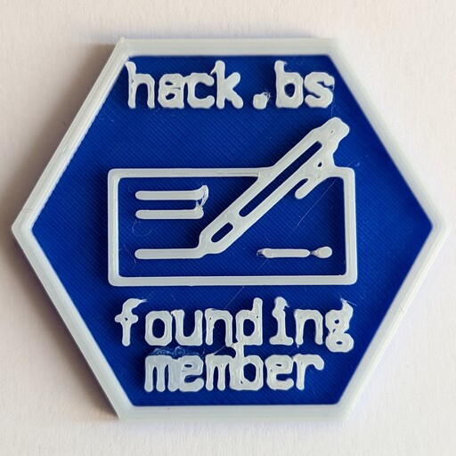

# Medals

This repo contains the open-source models for all the Medals released by [hack.bs](https://hack.bs.it).

The Medals are collectible physical tokens, awarded to a member when it accomplishes some kind of task or achievement.

## List

| Picture | Series Name | Year | Qty | Description |
| ------- | ----------- | ---- | --- | ----------- |
|  | [`founding_member`](founding_member/) | 2023 | 7 | Medal given to the seven founding members who signed the articles of association |
| to_insert | [`honorary_members`](/)| 2023 | tbd | Medal given to the honorary members of the association |
